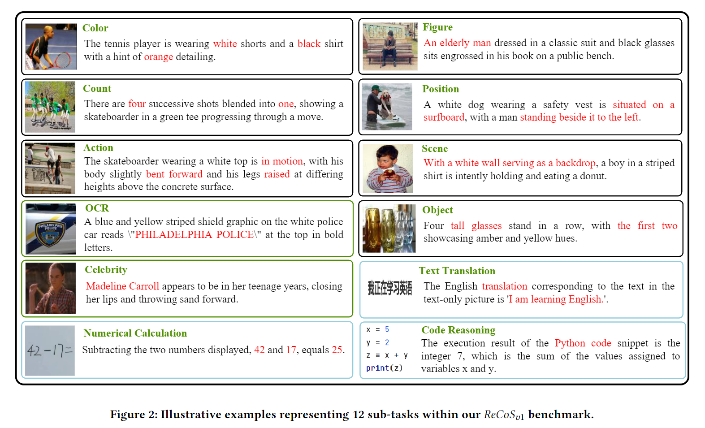
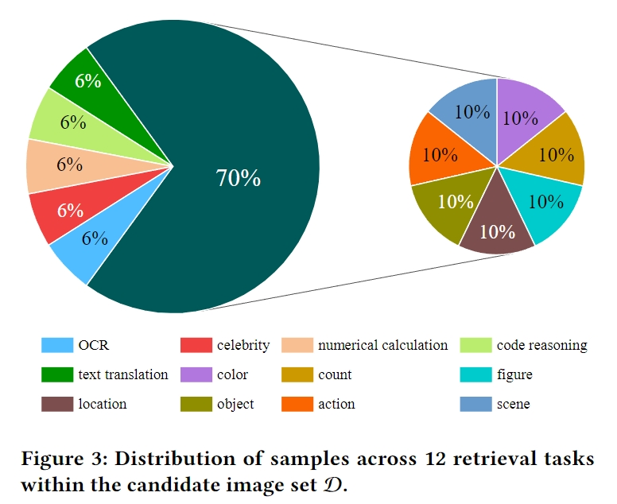
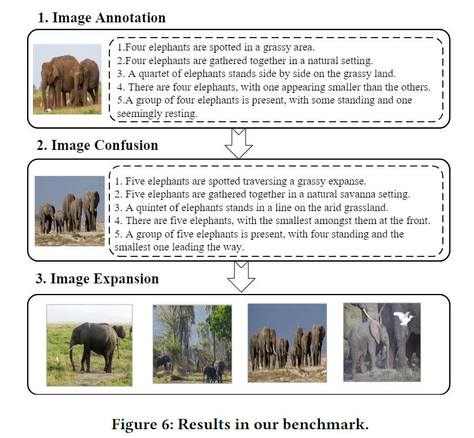
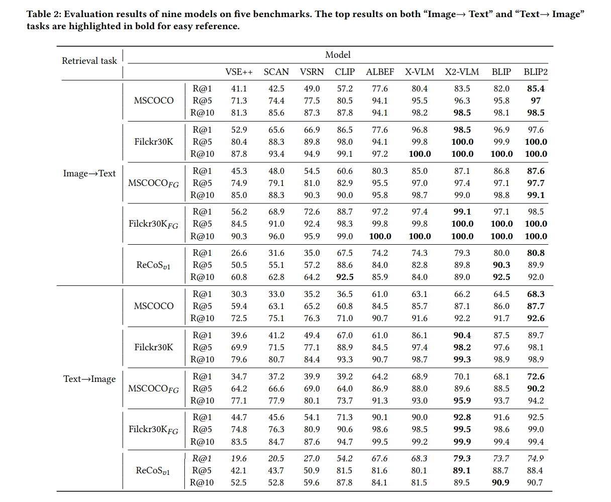

# ReCoS: A Novel Benchmark for Cross-Modal Image-Text Retrieval in Complex Real-Life Scenarios

## ReCoS

### Features

We posit that a comprehensive evaluation benchmark for image-text retrieval tasks should exhibit the following four characteristics:
- **Comprehensive Coverage:** Encompassing a wide array of subtasks, going beyond the recognition of specific objects. This includes aspects such as existence, count, position, color, and the composition of perceptual information with knowledge in Large Language Models (LLM) to handle more complex retrieval tasks, such as OCR retrieval, code image retrieval, and celebrity retrieval.
- **Original Data Sources:** Avoiding reliance on existing publicly available datasets to minimize the risk of data leakage and ensure the novelty of the benchmark.
- **Balanced Text Descriptions:** Striking a balance in text descriptions, avoiding being under-detailed to the point where retrieval becomes impossible and steering clear of over-detailed, making retrieval overly simplistic.
- **Alignment with Real-World Complexity:** Reflecting the intricacies of real-world scenarios to accurately gauge the capabilities of Visual-Language Pretraining models in diverse and challenging environments.

### Versions
In this section, we present the details of our new benchmark. 
We initiated the process by collecting a set of 500 images designed to address 12 types of retrieval tasks, 
encompassing complex real-life scenarios. Building upon this original dataset, we generated three versions 
of the benchmark. The first version, $ReCoS_{v0}$, consists of 500 image-text pairs. 
We then extended this set to create $ReCoS_{v1}$, which includes an additional 500 similar image-text pairs 
to $ReCoS_{v0}$ to increase task difficulty. Finally, $ReCoS_{v2}$ was formed by introducing 1940 additional 
pure images similar to the images in $ReCoS_{v0}$ to $ReCoS_{v1}$ to further increase task difficulty. 
The subsequent section provides a detailed account of the benchmark construction process.

### Construction Process
Illustrated in Figure6 is an example from our benchmark, beginning with an image featuring four elephants.
The annotation process involves associating the image with five diverse text descriptions. 
Subsequently, to augment task difficulty, we introduce image confusion by incorporating an image depicting five elephants. 
Lastly, we engage in image expansion by introducing four additional images, each portraying a different number of elephants. 
This multi-step process not only enriches the benchmark's complexity but also offers a dynamic representation of the challenges 
inherent in image-text retrieval tasks within our dataset.

### Experiments
We evaluated several representative image-text retrieval models on our new benchmarks 
and further analyzed their capabilities in complex real-life scenarios

## Download
### Images

We provide text descriptions and a portion of images for the Rescos dataset in both $ReCoS_{v1}$ and $ReCoS_{v2}$ versions. 
These images include four categories manually created: text translation, code reasoning, numerical calculation,
and celebrity. For the other eight categories, due to copyright restrictions, we only provide the official 
download links and image names, and authors are required to download them independently. Notably, images for the seven 
coarse-grained perceptual categories are sourced from the publicly available COCO dataset, while images for 
the OCR category are from the Totaltext public dataset.

See `images` for more details. If you wish to evaluate your model on our new benchmarks, you can turn to the offical website of [COCO](https://cocodataset.org) and [TotalText](https://github.com/cs-chan/Total-Text-Dataset) to download the corresponding images.

### Text Annotations
See `recos_v1.json` for more details.
